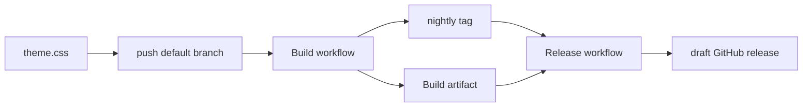

## Typical development workflow

Local iterate, then CI bakes `nightly`, draft release manually.

Release never rebuilds. It re-tags the last successful Build.

1. Edit `theme.css` (or `inspector.css`, `upstream`, overlay/build scripts). Preview without CI: `./scripts/development.sh` overlays the last successful Build artifact under `~/.local/share/chromium`. Hue knobs are local-only unless you change `scripts/overlay.sh`.
2. Commit and push to the default branch. Build runs only if the path is in its filter (`theme.css`, `inspector.css`, `upstream`, listed scripts, `.github/workflows/**`). README-only pushes do not build. Monday 06:00 UTC cron also builds. Manual **Actions → Build → Run workflow** can override hues for that run only; push and cron always bake `overlay.sh` defaults. `workflow_dispatch` exists only on the default branch.
3. Build: `scripts/resolve.sh` reads [`upstream`](upstream) (`stable`) and pins the Chrome DevTools ref. Schedule skips if `nightly`'s subject already has that ref. Then `scripts/build.sh`, upload `devtools-frontend.tar.zst`, force-push annotated `nightly` on that run's `$GITHUB_SHA` with subject `$REF chromium@$CHROME`. Screenshots force-push to the `screenshots` branch.
4. Wait until Build is green and `nightly` moved. Local check: `./scripts/development.sh -f`.
5. **Actions → Release → Run workflow**. Pick `bump` (`rc` default, or patch / minor / major), optional `notes`. No version string.
6. Release peels `nightly^{}`, finds a successful Build run with the same `headSha` (last 30), downloads that artifact, bumps the next `v*` from the latest `v[0-9]*` tag, creates a **draft** `gh release` with `--target` that SHA. `rc` tags are `--prerelease`. It does not push its own git tag beyond what `gh release create` does.
7. Open the draft on GitHub, review notes and the tar, publish. Users grab `devtools-frontend.tar.zst` from the published release.

Rules:

- `rc` on `x.y.z` → `x.y.(z+1)-rc.1`
- `rc` on `x.y.z-rc.n` → `x.y.z-rc.(n+1)`
- `patch` on `x.y.z-rc.n` → `x.y.z` (graduate)
- `patch` on `x.y.z` → `x.y.(z+1)`
- `minor` → `x.(y+1).0`
- `major` → `(x+1).0.0`
