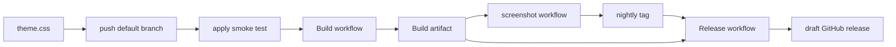

# Typical development workflow

Local iterate, then CI bakes `nightly`, draft release manually.

Release never rebuilds. It re-tags the last successful Build.

1. Edit `config.css`, `theme.css`, or `inspector.css`. Preview without CI: `./apply` overlays the latest release tar under `~/.local/share/chromium`. Hue numbers come from `config.css`. Push/cron bake that file. A manual Run workflow can override hue inputs for that run only.
2. Commit and push to the default branch. Build runs only if the path is in its filter (`apply`, `config.css`, `theme.css`, `inspector.css`, listed scripts including `screenshot.html`, `.github/workflows/**`). README-only pushes do not build. Monday 06:00 UTC cron also builds. Manual **Actions → Build → Run workflow** can override hue inputs for that run only; push and cron always bake `config.css`. Empty hue inputs fall through to `config.css`. `workflow_dispatch` exists only on the default branch.
3. Build: `scripts/resolve.sh` uses `CHANNEL` (`stable`) and pins the Chrome DevTools ref.
   Schedule skips if `nightly`'s subject already has that ref.
   `scripts/test.sh` verifies local apply idempotence and failed-archive safety.
   Then `scripts/build.sh` uploads `devtools-frontend.tar.zst`.
   Screenshots capture `screenshot-0` at `--hue` from env or `config.css`, then the `HUES` gallery.
   They publish to the `screenshots` branch only if PNGs or the gallery README changed.
   That branch README is the gallery block extracted from main `<!-- screenshots -->` markers.
   Main README gallery between those markers updates only if that block changed.
   Only then does `publish` force-push annotated `nightly` at that run's `$GITHUB_SHA`;
   its body records the exact GitHub Actions run ID.
   Artifact retention is about 90 days. Release before it expires.
4. Wait until Build is green and `nightly` moved. `./apply -f` fetches the latest **published** release, not this bake. To try the new tar, download the Actions artifact for the `run@` in the nightly tag body, then `./apply /path/to.tar.zst`.
5. **Actions → Release → Run workflow**. Pick `bump` (`rc` default, or patch / minor / major), optional `notes`. No version string.
6. Release peels `nightly^{}`, reads `run@` from its body, downloads that artifact,
   and bumps the next `v*` from the latest `v[0-9]*` tag.
   It makes an empty commit on the nightly SHA, pushes an annotated `v*` tag there,
   then `gh release create` (no `--target`) attaches the **draft** to that tag.
   Empty commit is required: `GITHUB_TOKEN` cannot tag a commit that touched
   `.github/workflows/**`. `rc` tags are `--prerelease`.
7. Open the draft on GitHub, review notes and the tar, publish. Users grab `devtools-frontend.tar.zst` from the published release.

Rules:

- `rc` on `x.y.z` → `x.y.(z+1)-rc.1`
- `rc` on `x.y.z-rc.n` → `x.y.z-rc.(n+1)`
- `patch` on `x.y.z-rc.n` → `x.y.z` (graduate)
- `patch` on `x.y.z` → `x.y.(z+1)`
- `minor` → `x.(y+1).0`
- `major` → `(x+1).0.0`
